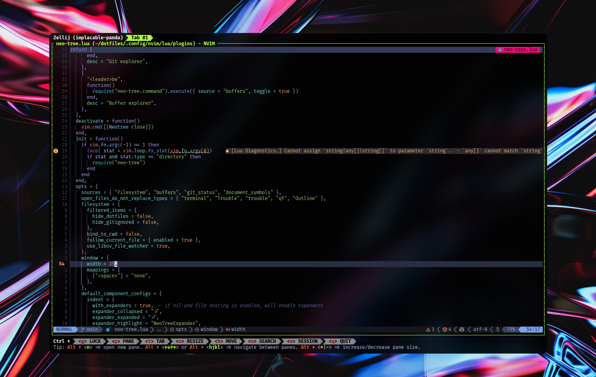
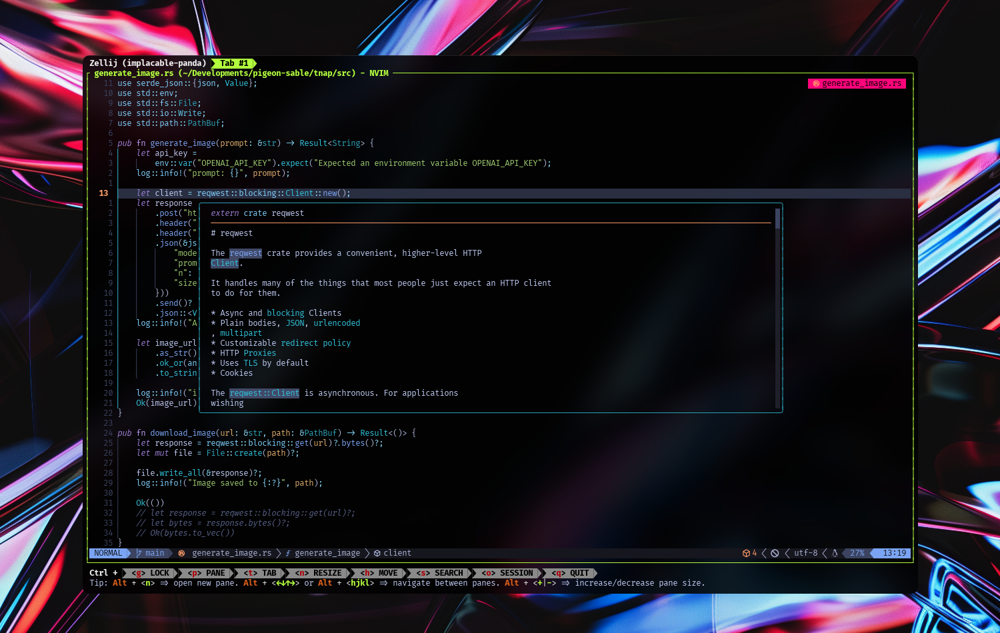
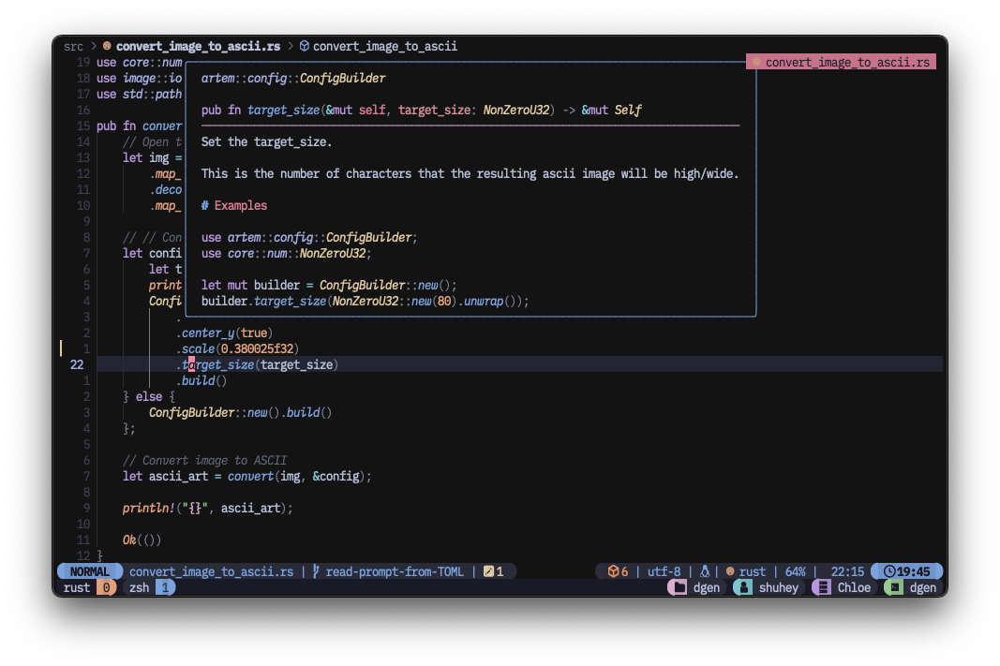
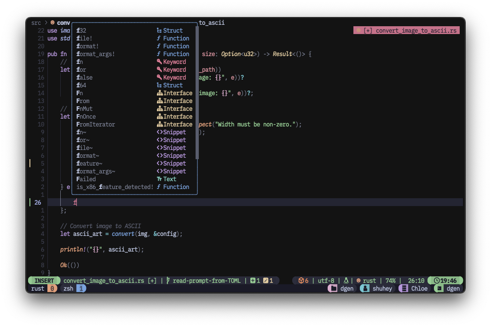

# Shuhey's dotfiles

    
    
    
    

## 🤟 I love Neovim

> 🚨 Before using these config files, it is recommended that you understand what they will set. Use at your own risk.

- This dotfiles repository is to make my development environment supremely cool and to keep me happy.
- If you have a better tool or advice on how to do it better, I would be happy to hear it.
- These configs (especially Neovim config) are based on [craftzdog/dotfiles-public](https://github.com/craftzdog/dotfiles-public) and [josean-dev/dev-environment-files](https://github.com/josean-dev/dev-environment-files). Thank you very much.
- I also referred to many other documents for these configs. Thanks to all open source projects.
- In addition, some of these configs are written with the reliable copilot, ChatGPT.

## 👉 Contents

- Neovim config
- tmux config
- Zsh config

## 🫶 Neoim setup

### Requirements

- [**_Neovim_**](https://neovim.io/) >= **v0.9.5** (need to be built with **LuaJIT**)
- [**_LazyVim_**](https://www.lazyvim.org/)
- a [Nerd Font](https://www.nerdfonts.com/) >= v3.1.1 **_(optional, but needed to display some icons)_**
  - I use [**_PlemolJP_**](https://github.com/yuru7/PlemolJP).
- for [telescope.nvim](https://github.com/nvim-telescope/telescope.nvim) **_(optional)_**
  - live grep: [ripgrep](https://github.com/BurntSushi/ripgrep)
  - find files: [fd](https://github.com/sharkdp/fd)
- a terminal that supports true color (below are some of my favorites):
  - [**_Rio Terminal_**](https://raphamorim.io/rio/) - I'm crazy about this terminal emulator.
  - [iTerm2](https://iterm2.com/)
- [**_Catppuccin for Neovim_**](https://github.com/catppuccin/nvim) - My fave

## 😎 Shell setup (macOS)

- [Zsh](https://www.zsh.org/)
- [Sheldon](https://github.com/rossmacarthur/sheldon) - Plugin manager
- [Starship](https://github.com/starship/starship) - Shell theme. I use [Pastel Powerline Preset](https://starship.rs/presets/no-empty-icons.html) with some customization.
- [Nerd Fonts](https://github.com/ryanoasis/nerd-fonts) - Powerline-patched fonts. I use [PlemolJP](https://github.com/yuru7/PlemolJP).
- [z](https://github.com/rupa/z) - Directory jumping
- [exa](https://the.exa.website/) - A modern replacement for `ls`
- [bat](https://github.com/sharkdp/bat?tab=readme-ov-file) - A `cat` clone with wings

## 😘 Acknowledgment

- [craftzdog/dotfiles-public](https://github.com/craftzdog/dotfiles-public) - My aspiring individual developer's dotfiles
- [josean-dev/dev-environment-files](https://github.com/josean-dev/dev-environment-files) - Cool dev environment

## 👋 About me

### Shuhey Koyama

- Undergraduate in CS
- HCI Research
- Interaction Design
- Sound
- Camera

### Contacts

- [@shuheykoyama on X](https://x.com/shuheykoyama)
