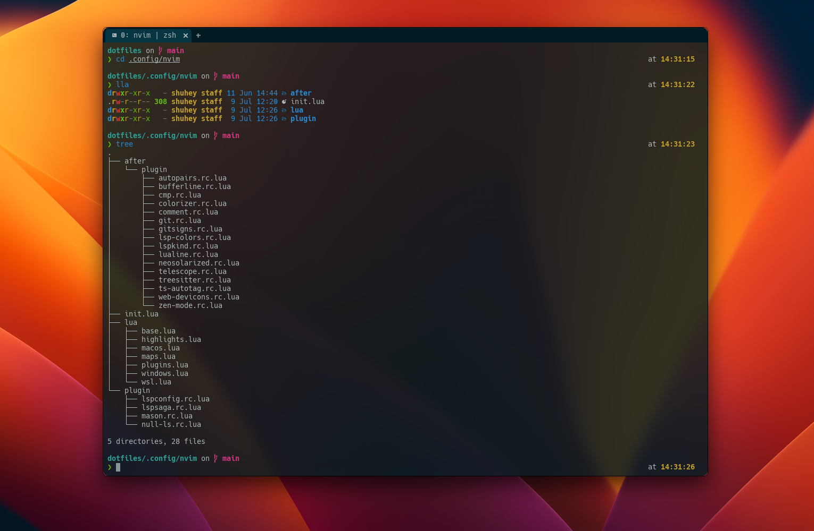
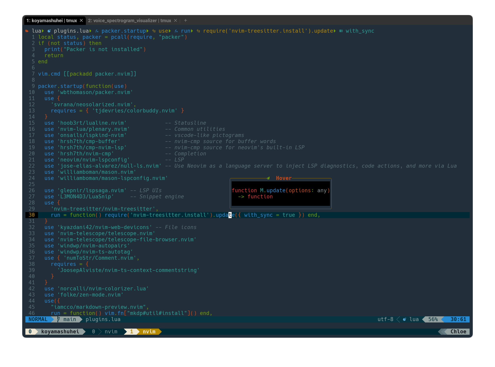
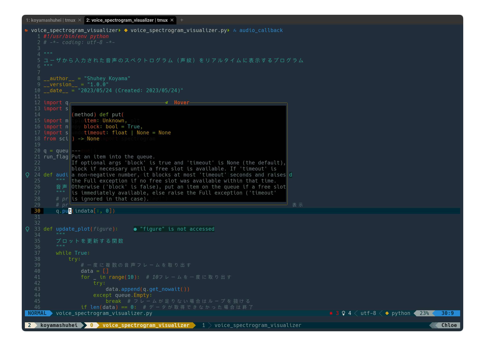

# Shuhey's dotfiles

🚨Warning!: Before using these config files, it is recommended that you understand what they will set. Use at your own risk!

## Contents

- vim (NeoVim) config
- tmux setting
- git config
- zsh config

## NeoVim setup

Requires [NeoVim](https://neovim.io/) (>= 0.9.1)

## Shell setup (macOS)

- zsh
- WezTerm
- Sheldon
- Starship
- Nerd Fonts
- z for zsh
- Exa

## About me

Shuhey Koyama

- [Twitter @shuheykoyama](https://twitter.com/shuheykoyama)
- [YouTube Shuhey Koyama](https://www.youtube.com/channel/UCzPjLzS8qL26bRrBDp4iPyw)
